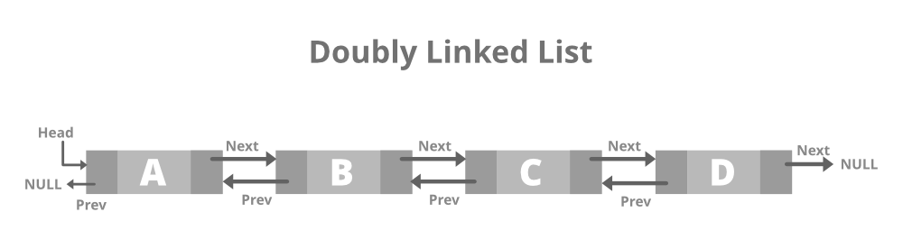
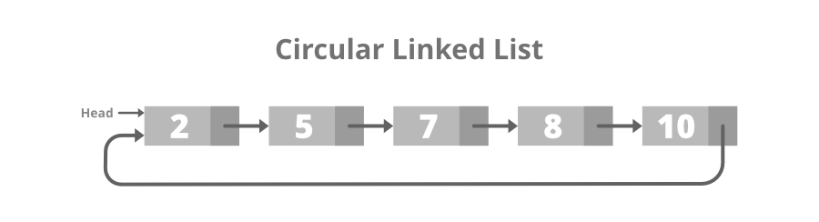
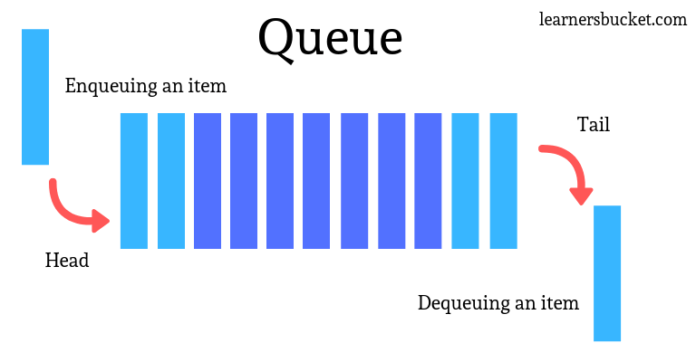
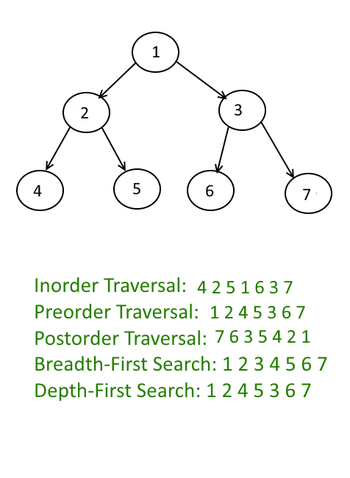

# Data Structures and Algorithms

## Lab 1: Sorting Algorithms

### 1.1 Bubble Sort

Bubble sort is a simple sorting algorithm. 
This sorting algorithm is comparison-based algorithm in which each 
pair of adjacent elements is compared and the elements are swapped 
if they are not in order. 
This algorithm is not suitable for large data sets as its average 
and worst case complexity are of Ο(n^2) where n is the number of 
items.

<p align="center">

</p>

````java
public class BubbleSort {
    public static int[] bubbleSort(int[] arr) {
        int i, j, temp;
        int n = arr.length;
        boolean swapped;

        for (i = 0; i < n-1; i++) {
            swapped = false;
            for (j = 0; j < n - i - 1; j++) {
                if (arr[j] > arr[j+1]) {
                    temp = arr[j];
                    arr[j] = arr[j + 1];
                    arr[j + 1] = temp;
                    
                    swapped = true;
                }
            }
            if (!swapped) break;
        }
        return arr;
    }
}
````

### 1.2 Selection Sort

The algorithm repeatedly selects the smallest (or largest) element
from the unsorted portion of the list and swaps it with the first 
element of the unsorted portion.

Selection Sort iterates through ``n - 1`` elements and, 
at each iteration ``i``, selects the minimum value and index putting it
at that index ``i``.

<p align="center">

</p>

````java
public class SelectionSort {
    public static int[] selectionSort(int[] arr) {
        int i, j, temp;
        int min, minPos;
        
        for (i = 0; i < n-1; i++) {
            min = arr[i];
            minPos = i;
            for (j = i + 1; j < n; j++) {
                if (arr[j] < min) {
                    min = arr[j];
                    minPos = j;
                }
            }
            
            temp = arr[i];
            arr[i] = min;
            arr[minPos] = temp;
        }
    }
}
````

### 1.3 Insertion Sort

Insertion sort is a simple sorting algorithm that works similar 
to the way you sort playing cards in your hands. The array is 
virtually split into a sorted and an unsorted part. Values from 
the unsorted part are picked and placed at the correct position 
in the sorted part.

Insertion Sort assumes that the first element of the array is the
initial sorted array.
Then iterate the elements from ```1:n-1```. 
At each iteration, compare element at step ``i`` with the elements 
in the sorted array (``j = 0 : i-1``) and swap until necessary.

<p align="center">

</p>

````java
public class InsertionSort {
    public static int[] insertionSort(int[] arr) {
        int i, j, temp;
        int n = arr.length;

        for (i = 1; i < n; i++) {
            j = i;
            while (j > 0 && arr[j - 1] > arr[j]) {
                temp = arr[j];
                arr[j] = arr[j-1];
                arr[j-1] = temp;
                j--;
            }
        }
        return arr;
    }
}
````

### 1.4 Merge Sort
Merge sort is a sorting algorithm that works by dividing an array into smaller subarrays, sorting each subarray, and then merging the sorted subarrays back together to form the final sorted array.

<p align="center">

</p>

````java
public class MergeSort {
    public static void mergeSort(int[] arr) {
        split(arr, arr.length);
    }

    public static void split(int[] arr, int n) {
        if (n < 2)
            return;

        int middle = n / 2;

        int[] L = new int[middle];
        int[] R = new int[n - middle];

        for (int i = 0; i < middle; i++) {
            L[i] = arr[i];
        }

        for (int j = middle; j < n; j++) {
            R[j - middle] = arr[j];
        }

        split(L, L.length);
        split(R, R.length);

        merge(arr, L, R, middle, n-middle);
    }

    public static void merge(int[] a, int[] L, int[] R, int left, int right) {
        System.out.println("[*] MERGE: " + Arrays.toString(L) + " R: " + Arrays.toString(R));
        int i = 0, j = 0, k = 0;

        while (i < left && j < right) {
            if(L[i] < R[j]) {
                a[k++] = L[i++];
            } else {
                a[k++] = R[j++];
            }
        }

        while (i < left) {
            a[k++] = L[i++];
        }

        while (j < left) {
            a[k++] = R[j++];
        }
        System.out.println(Arrays.toString(a));
    }
}
````

### 1.5 Quick Sort

Select a random pivot and swap it with the last index. 
Move values lower than pivot to the left and bigger to the right.

<p align="center">

</p>

````java
public class QuickSort {
    public static void quickSort(int[] arr, int lowIndex, int highIndex) {
        if (lowIndex >= highIndex)
            return;
        int pivotIndex = (lowIndex + highIndex + 1)/2;
        int pivotValue = arr[pivotIndex];

        swap(arr, pivotIndex, highIndex);

        int leftPointer = lowIndex;
        int rightPointer = highIndex;

        while (leftPointer < rightPointer) {
            while (arr[leftPointer] < pivotValue && leftPointer < rightPointer) leftPointer++;
            while (arr[rightPointer] > pivotValue && leftPointer < rightPointer) rightPointer--;

            swap(arr, leftPointer, rightPointer);
        }

        quickSort(arr, lowIndex, leftPointer - 1);
        quickSort(arr, leftPointer, highIndex);

    }
}
````

## Lab 2: Linked Lists

### 2.1 Singly Linked List
It is the simplest type of linked list in which every node contains some data and a pointer to the next node of the same data type.


### 2.2 Doubly Linked List

A doubly linked list or a two-way linked list is a more complex type of linked list that contains a pointer to the next as well as the previous node in sequence.
This would enable us to traverse the list in the backward direction as well.



### 2.3 Circular Linked List

A circular linked list is that in which the last node contains the pointer to the first node of the list. 



## Lab 3: Stacks, Queues, MinHeap

### 3.1 Stacks
Stack is a linear data structure that follows a particular order in which the operations are performed. The order may be LIFO(Last In First Out) or FILO(First In Last Out). LIFO implies that the element that is inserted last, comes out first and FILO implies that the element that is inserted first, comes out last.


### 3.2 Queues
A Queue is defined as a linear data structure that is open at both ends and the operations are performed in First In First Out (FIFO) order.



### 3.3 Min Binary Heap

A Binary Heap is either Min Heap or Max Heap. In a Min Binary Heap, the key at the root must be minimum among all keys present in Binary Heap. The same property must be recursively true for all nodes in Binary Tree. Max Binary Heap is similar to MinHeap.

````text
            10                       10
         /      \                 /      \  
        20     100              15       30  
       /                      /   \     /   \
     30                     40    50   100  40


````

<div style="background-color:white">
    
</div>

## Lab 4: Trees

### 4.1 Tree Traversal
